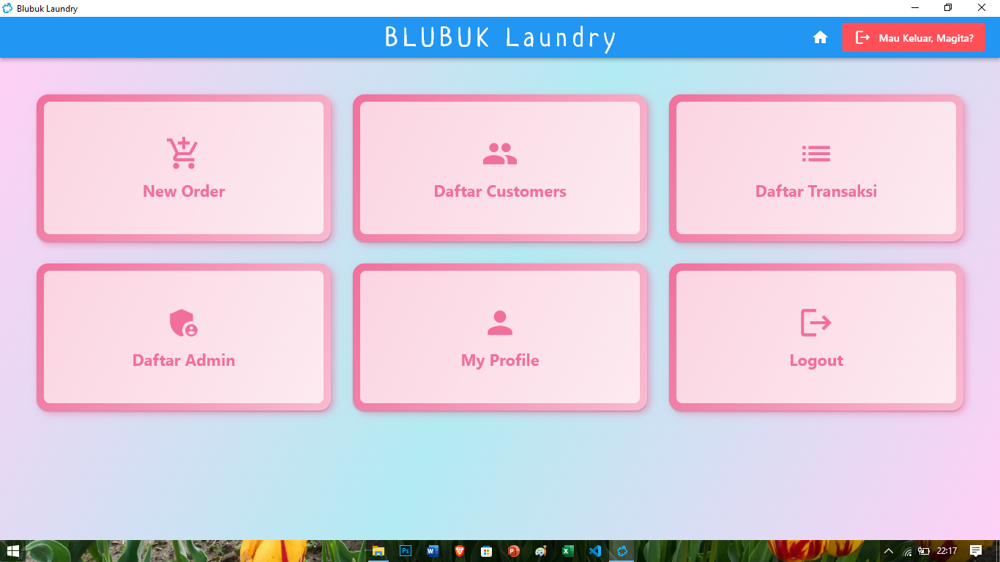
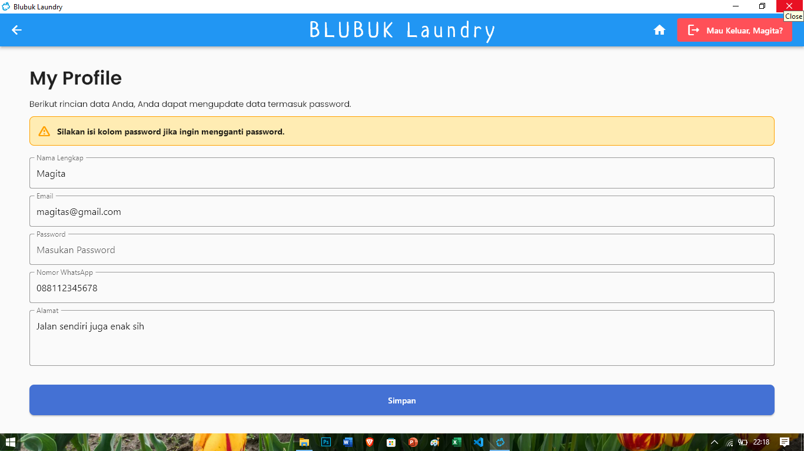
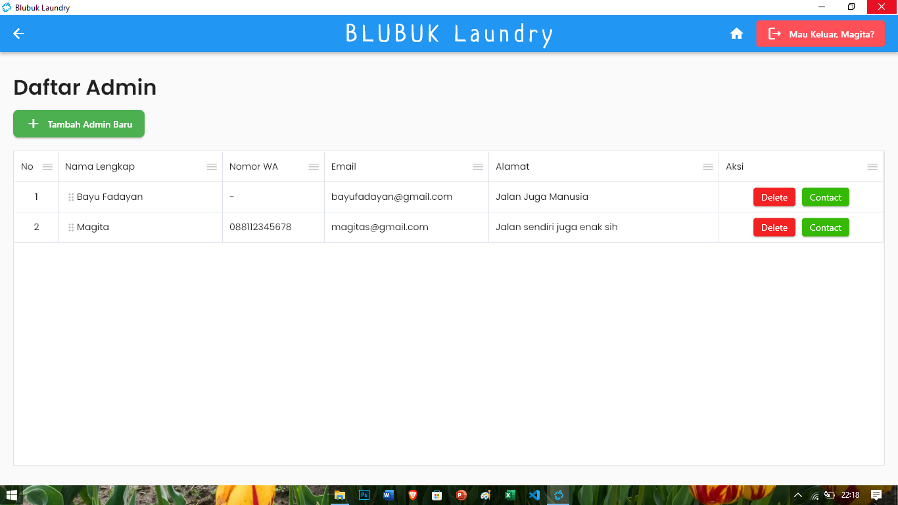
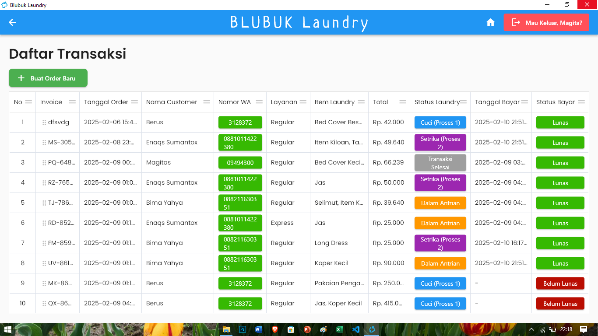
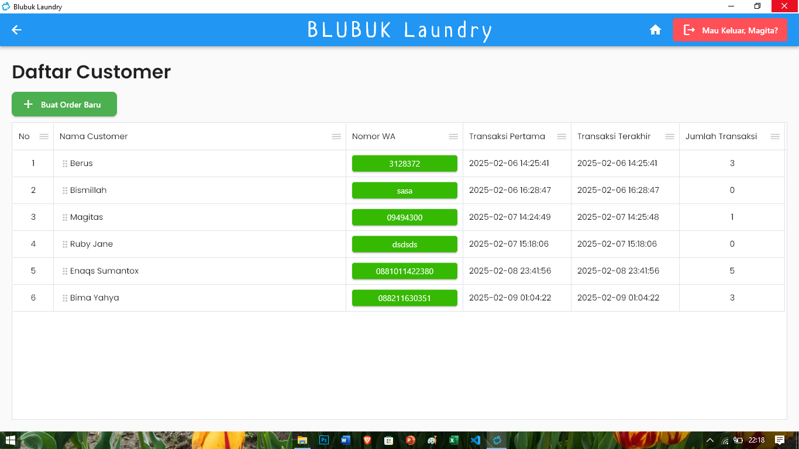
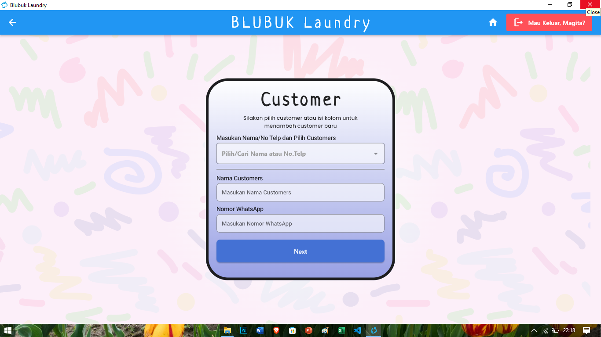
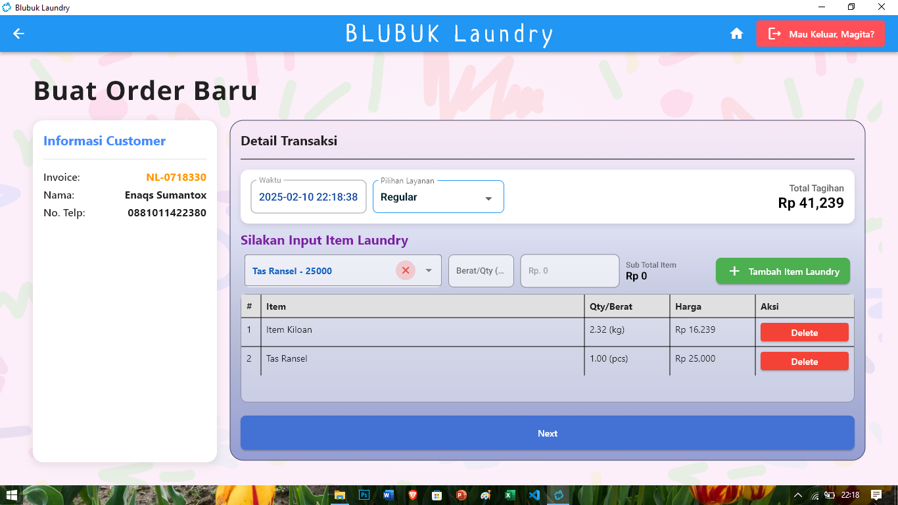
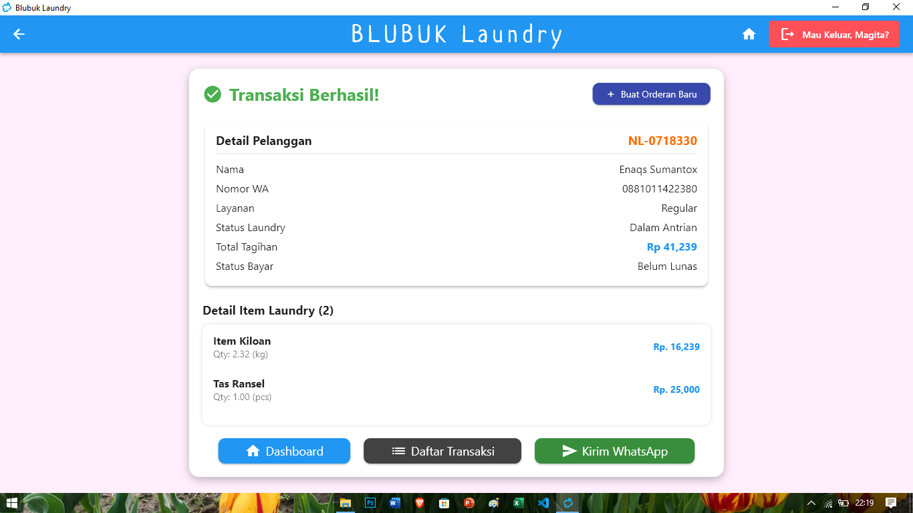

# Blubuk Laundry Desktop v2.0

Aplikasi pencatatan order untuk toko laundry berbasis **Flutter** yang menggunakan **PHP dan MySQL** sebagai database backend. Aplikasi ini kompatibel dengan **Windows Desktop x64**.

## 🚀 Fitur
1. **Order Laundry**: Melakukan order laundry sesuai kategori dan dengan kalkulasi harga otomatis serta kirim nota ke WhatsApp.
2. **Customer List**: Melihat daftar pelanggan untuk melihat insight loyalitas pelanggan.
3. **Manajemen Transaksi**: Menambah dan Update transaksi
4. **Manajemen Admin**: Atur akun admin untuk mengelola sistem.
5. **Manajemen My Profile**: Edit dan perbarui profil pengguna.

---

## 📥 Download Aplikasi
> **Note:** Versi **installer mengalami crash**, gunakan **versi portable**.

- **Portable**: [Download di sini](https://drive.google.com/drive/folders/12epCsDb3yK6c2S2VLJ5EzhGPMLzFj16l?usp=drive_link)
- **Installer**: [Download di sini](https://drive.google.com/file/d/1WLZ1kcVatxTqDPvVxs-d1LtvuhJc-myD/view?usp=drive_link) _(⚠ Tidak direkomendasikan)_

---

## 🛠️ Cara Instalasi

### 1️⃣ Download dan Ekstrak Aplikasi
1. Unduh versi **portable** dari link di atas.
2. Ekstrak file ke lokasi yang diinginkan.

### 2️⃣ Setup Database Lokal
1. Install **XAMPP** atau **Laragon** (rekomendasi: **Laragon**).
2. Buka **Command Prompt (CMD)** dan masuk ke direktori Laragon:

   ```sh
   cd /
   cd laragon
   cd www
   ```

3. Clone API backend dari GitHub:

   ```sh
   git clone https://github.com/bayufadayan/blubuk-laundry-api
   ```

4. Pastikan folder API **bernama `blubuklaundry`** dan berjalan di **port 8080**.

### 3️⃣ Konfigurasi Aplikasi
Jika API tidak berjalan di **port 8080** atau folder API tidak bernama `blubuklaundry`, lakukan langkah berikut:
1. Edit file **`lib/utils/config.dart`** dalam aplikasi Flutter.
2. Ubah **URL API** sesuai dengan konfigurasi yang digunakan.
3. Rebuild aplikasi agar perubahan diterapkan.

---

## 🎥 Demo
[Youtube](https://www.youtube.com/watch?v=kHiKW5R3ZHc)
[](https://www.youtube.com/watch?v=kHiKW5R3ZHc)

---

## 📸 Screenshoot









---

## 📌 Catatan
- Aplikasi ini masih dalam tahap pengembangan, pastikan selalu menggunakan versi terbaru.
- Jika mengalami kendala, silakan hubungi pengembang melalui GitHub atau media lainnya.

---

## 📧 Kontak Pengembang
- **GitHub**: [@bayufadayan](https://github.com/bayufadayan)
- **Email**: bayufadayan@gmail.com


💡 **Terima kasih telah menggunakan Blubuk Laundry Desktop!** 🚀

